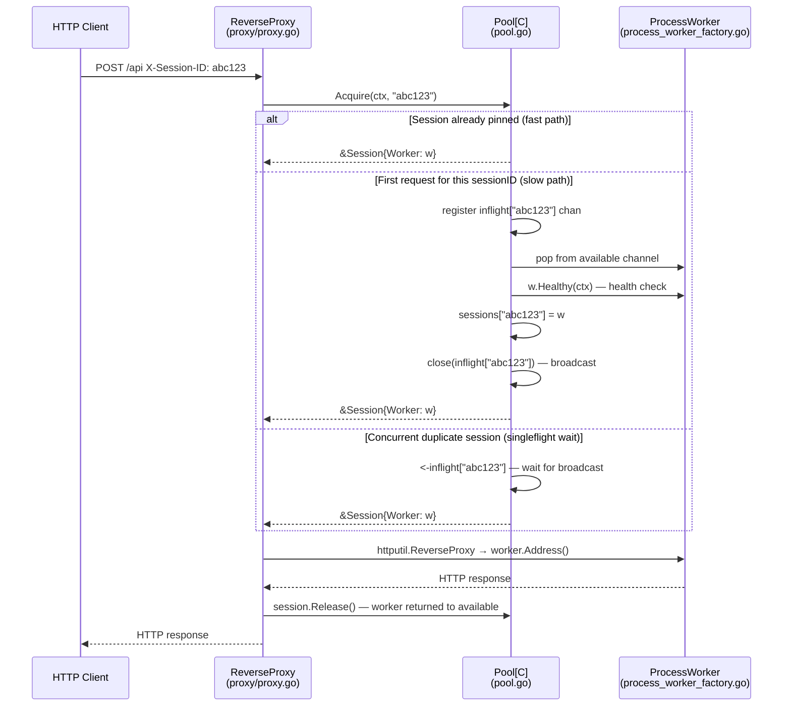
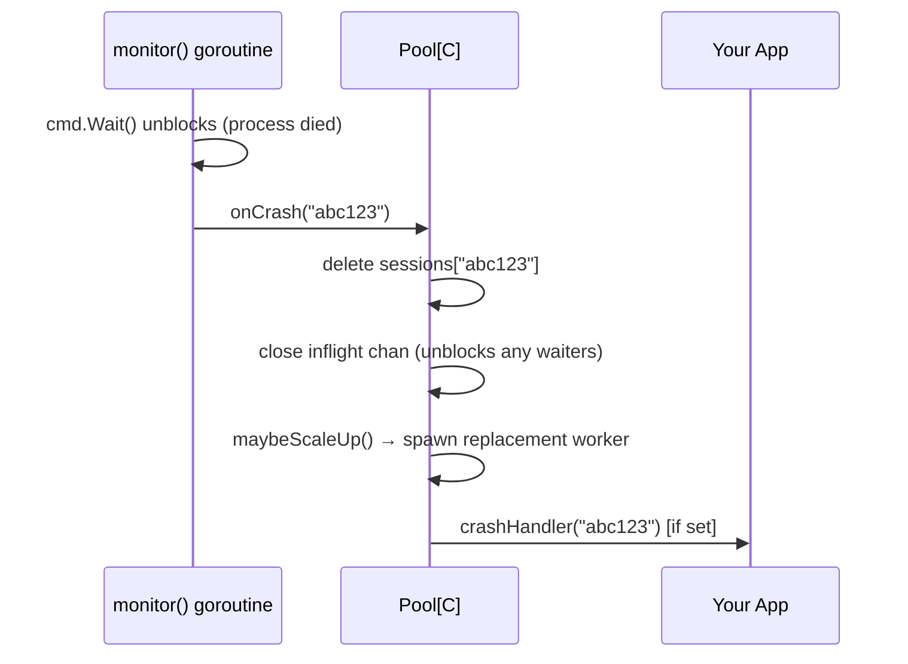

# Dual-Mode Design

Herd is built to support two primary usage patterns: acting as a **headless resource pool** accessed via code, or as a **self-contained Reverse Proxy** that transparently routes traffic.

---

## 🔬 A. Visual Flow (Reverse Proxy Mode)

The diagram below shows the full lifecycle of an HTTP request through `NewReverseProxy`.

### Crash Path

---

## 🧩 B. Component Breakdown

### `WorkerFactory[C]` — The Engine
Defined in [`worker.go`](https://github.com/herd-core/herd/blob/main/worker.go). This is the **only component that touches the OS**.  
`ProcessFactory` (the default implementation in [`process_worker_factory.go`](https://github.com/herd-core/herd/blob/main/process_worker_factory.go)) calls `exec.Cmd`, allocates a free port, and polls `GET /health` until the process is ready.

### `Pool[C]` & `Session[C]` — The Brain
Defined in [`pool.go`](https://github.com/herd-core/herd/blob/main/pool.go). Enforces the core invariant: **1 sessionID → 1 Worker, for the lifetime of the session**.

The singleflight lock exists to handle a specific race: if two requests for the same session ID arrive at exactly the same time, without the lock they could both pop workers and pin *different* workers to the same session—breaking affinity.

### `ReverseProxy[C]` — The Front door
Defined in [`proxy/proxy.go`](https://github.com/herd-core/herd/blob/main/proxy/proxy.go). Intercepts HTTP requests, calls your `extractSessionID` function to determine which session this request belongs to, pauses to acquire the correct worker via `Pool.Acquire`, reverse-proxies the traffic, and releases the worker after the response is written.

---

## 💡 C. Design Tenets

### Why 1:1 Session Affinity?
**To isolate blast radius.** If a process or session crashes, only *one* user's session is affected. Subprocesses carried state in OS memory, open file descriptors, and GPU contexts that cannot be easily shared or checkpointed.

### Why Processes, Not Goroutines?
**Because Herd manages external stateful binaries.** The processes it manages operate outside the Go runtime with their own memory and execution models.

### Why the Built-in Proxy?
**Because a pool without a router is just a map.** `NewReverseProxy` collapses the acquire-proxy-release boilerplate into a single `http.Handler` line so you focus purely on application logic.
